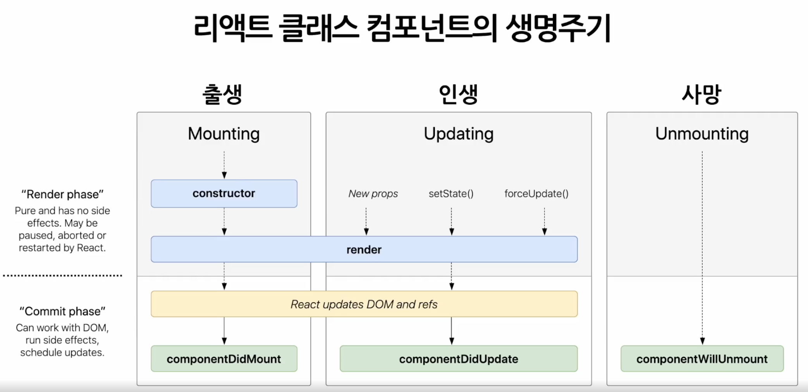

# State (상태)

- React Component의 state(상태) = 변경 가능한 데이터
- 개발자가 직접 정의함
- state가 변경될 경우 재렌더링되므로, 렌더링이나 데이터 흐름에 사용되는 값만 포함해야 함
- state는 Javascript 객체
- state는 직접 수정할 수 없음
  - setState 함수를 통해서 수정해야 함

# Lifecycle (생명주기)

- 컴포넌트는 시간의 흐름에 따라 생성되고 업데이트 되다가 사라짐
