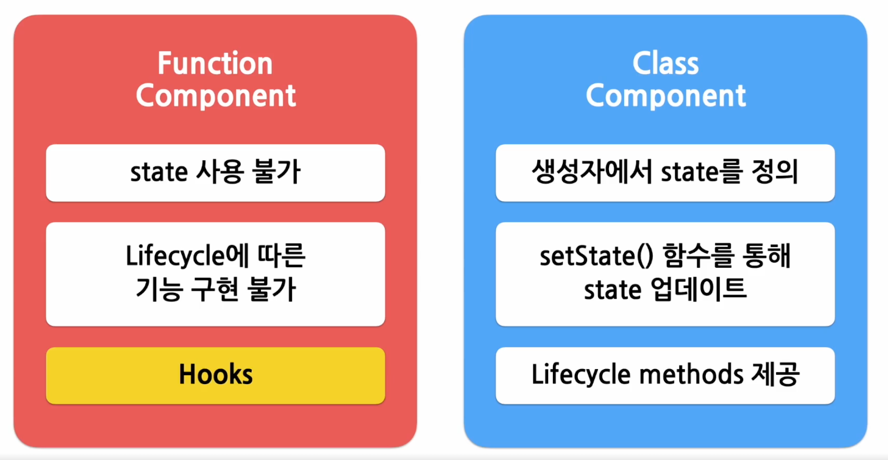

# Hooks

- 리액트 컴포넌트는 함수 컴포넌트와 클래스 컴포넌트가 있음
- Hooks : 함수 컴포넌트에서 Lifecycle methods와 유사하게 원하는 시점에 사용하기 위해 추가된 기능

## useState()

- state를 사용하기 위한 Hook
- `const [변수명, set함수명] = useState(초기값);`
  - 각 변수마다 개별적으로 set 함수가 존재함

## useEffect()

- side effect를 실행할 수 있게 해주는 Hook
  - 다른 컴포넌트에 영향이 있는 기능
- 클래스 컴포넌트의 생명주기 함수와 동일한 기능 제공
  - `componentDidMount`, `componentDidUpdate`, `componentWillUnmount` 기능 통합
- `useEffect(이펙트 함수, [의존성 변수1, 의존성 변수2, ...]);`
  - 의존성 배열에 있는 데이터 중 하나라도 값이 변경되면 실행됨
  - 의존성 배열에 빈 배열([]) 전달 시 mount / unmount 단 한 번씩만 실행
  - 의존성 배열 생략 시 컴포넌트가 업데이트 될 때마다 호출
    - `componentDidMount`, `componentDidUpdate`와 동일한 동작
- `return` : 컴포넌트가 unmount 될 때 호출됨

## useMemo()

- Memoized value를 리턴하는 Hook
  - 연산량이 높은 작업을 수행하여 결과 반환
  - 계산된 값을 저장해두고, 내부 값이 변경될 때만 다시 계산하여 반환함
  - 매 렌더링마다 계산하는 것을 방지할 수 있음
- `const memoizedValue = useMemo(createMethod, [의존성 변수1, 의존성 변수2, ...])`
  - 의존성 배열을 생략하는 경우 매 렌더링마다 함수가 실행되므로 의미가 없음 (권장X)
  - 의존성 배열에 빈 배열 전달 시 컴포넌트 마운트 시에만 호출됨

## useCallback()

- `useMemo()`과 유사하며, 값이 아닌 함수를 반환
  - `useCallback(함수, 의존성 배열)` = `useMemo(() => 함수, 의존성 배열)` -> 동일한 기능
- `const memoizedCallback = useCallback(callback, [의존성 변수1, 의존성 변수2, ...])`

## useRef()

- Reference를 사용하기 위한 Hook
  - `Reference` : 특정 컴포넌트에 접근할 수 있는 객체
    - `refObject.current` : 현재 참조하고 있는 element
- `const refContainer = useRef(초기값);`
- 내부의 데이터가 변경되었을 때 별도 알림이 없음
  - Callback ref를 사용하여 다른 노드와 연결되거나 해제를 체크할 수 있음

# Hooks 규칙

- 무조건 최상위 레벨에서만 호출해야 함
  - 컴포넌트가 렌더링 될 때마다 같은 순서로 호출되어야 함
  - (ex. if 조건문에 따라 실행하거나 안하거나 달라지는 것은 잘못된 사용)
- 리액트 함수 컴포넌트에서만 호출해야 함
  - 자바스크립트에서 사용 불가
- cf. eslint-plugin-react-hooks

# Custom Hooks

- 다른 Hook을 호출하는 자바스크립트 함수
- 여러 컴포넌트에서 반복적으로 사용하는 중복 코드를 줄일 수 있음
- 반드시 `use`로 시작하는 네이밍 규칙
- 여러 개의 컴포넌트에서 동일한 Custom Hook 사용 시 컴포넌트 내부의 state와 effects는 모두 독립적으로 존재함 (공유하지 않음)
  - Hook 간 파라미터(인수)를 통해 데이터 공유 가능
