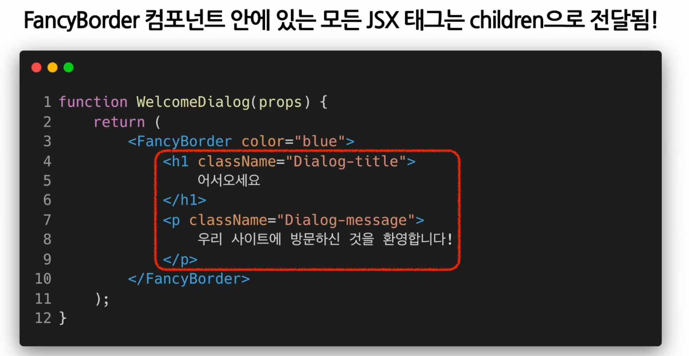

# Composition

- 여러 개의 컴포넌트를 조합, 합성하는 방식

## Containment

- 하위 컴포넌트를 포함하는 형태의 합성 방법
- `props.children` 사용
- 각각 다른 children 전달이 필요한 경우 별도 props로 지정해야 함



```js
React.createElement(
  type,
  [props],
  [...children] // 해당
);

function SplitPane(props) {
  return (
    <div className="SplitPane">
      <div className="SplitPane-left">{props.left}</div>
      <div className="SplitPane-right">{props.right}</div>
    </div>
  );
}
function App(props) {
  return <SplitPane left={<Contacts />} right={<Chat />} />;
}
```

## Specialization

- 기존 객체지향 언어에서는 상속(Inheritance)을 사용하여 Specialization 구현
- 리액트에서는 composition을 사용하여 구현
- Containment와 Specialization 동시 사용 가능

# Inheritance

- 다른 컴포넌트로부터 상속 받아 새로운 컴포넌트를 만드는 것
- 리액트에서는 상속을 통해 권장할 만한 사례가 없음 -> Composition 사용 권장
- 복잡한 컴포넌트를 여러 개의 컴포넌트로 분리하고, 이를 조합하여 새로운 컴포넌트 만들어야 함
