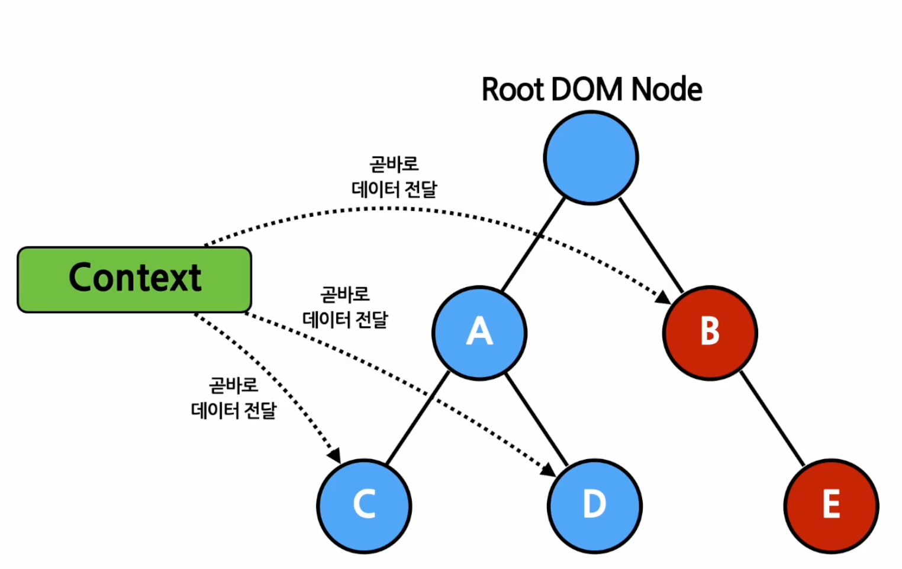

# Context



- 기존 props 데이터 전달 방식의 단점(props drilling 등)을 보완
- 여러 개의 Component들이 사용하는 데이터 접근 시 사용
  - ex. 로그인 정보, UI 테마, 언어 등
- 고려할 점
  - 코드 가독성, 복잡성 증가
  - 컴포넌트 자체를 변수에 저장하여 직접 전달하는 방식 가능 (cf. chapter09)
  - 하위 컴포넌트를 여러 개의 변수로 나눠서 전달 가능

# Context API

## React.createContext()

- 기본값 파라미터로 전달하여 context 생성
- 기본값으로 `undefined` 설정 시 사용되지 않음

## Context.Provider

- 하위 컴포넌트를 감싸면 컨텍스트 데이터 사용 가능
- 직접 전달하기 보다 state에 저장하여 사용 (불필요한 재렌더링 방지)

```js
const MyContext = React.createContext(기본값);

function App(props) {
  const [value, setValue] = useState({ something: "something" });

  return (
    <MyContext.Provider value={value}>
      <Children />
    </MyContext.Provider>
  );
}
```

## Class.contextType

- provider 하위에 있는 클래스 컴포넌트에서 컨텍스트 데이터 사용 가능
- 거의 사용하지 않음

## Context.Consumer

- 함수 컴포넌트에서 컨텍스트 사용하는 방식

```jsx
<MyContext.Consumer>
  {value => /* 컨텍스트 값에 따라 컴포넌트 렌더링 */}
</MyContext.Consumer>
```

## Function as a child

```jsx
// children props 직접 선언하는 방식
<Profile children={name => <p>이름: {name}</p>} />

// Profile 컴포넌트로 감싸서 children으로 만드는 방식
<Profile>{name => <p>이름: {name}</p>}</Profile>
```

## Context.displayName

```jsx
const MyContext = React.createContext(기본값);
MyContext.displayName = "MyDisplayName";

// 개발자 도구에서 "MyDisplayName.Provider"로 표시됨
<MyContext.Provider />

// 개발자 도구에서 "MyDisplayName.Consumer"로 표시됨
<MyContext.Consumer />
```

## 다중 Context

- Context Provider나 Consumber 태그를 중첩으로 감싸서 사용함

## useContext()

- 함수 컴포넌트에서 Hook 사용

```js
function MyComponent(props) {
  // Consumer 나 Provider 가 아닌 Context 전달
  const value = useContext(MyContext);

  return (
    ...
  )
}
```
