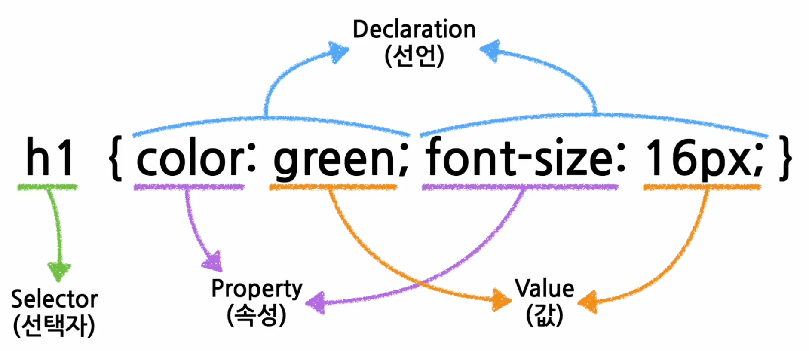
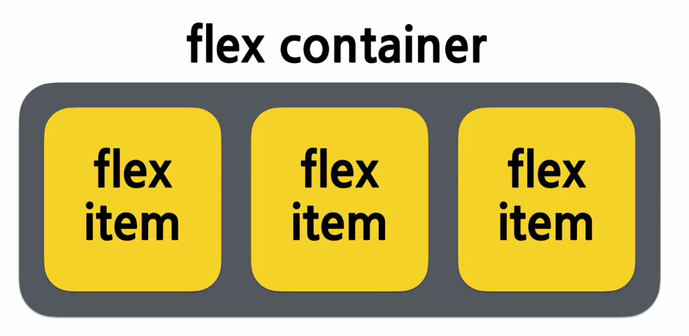
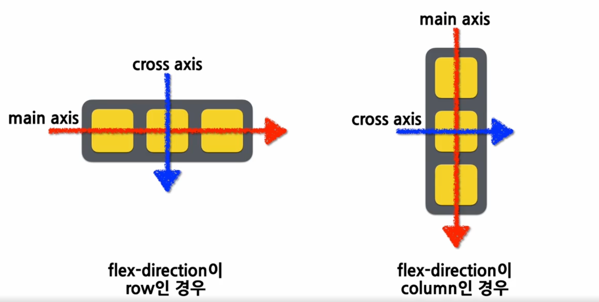

# CSS

- Cascading Style Sheets



## Selector

- 어떤 요소에 스타일을 설정할 것인지 지정하는 선택자

### 선택자 유형

- Element selector : 태그명 스타일 적용

```css
h1 {
  color: green;
}
```

- ID selector : `#id` 스타일 적용

```css
<div id="section" > ...</div > #section {
  background-color: black;
}
```

- Class selector : `.class` 스타일 적용

```css
<span class="medium">...</span>
<p class="medium">...</p>

/* 전체 medium class 적용 */
.medium {
  font-size: 20px;
}
/* p 태그의 medium class에만 적용 */
p.medium {
  font-size: 12px;
}
```

- Universal selector : `*` 전체 스타일 적용

```css
* {
  font-size: 20px;
  color: blue;
}
```

- Grouping selector : 중복되는 스타일을 그룹으로 묶어서 적용

```css
h1,
h2,
p {
  color: black;
  text-align: center;
}
```

- 상태 관련 selector
  - `:hover` : 마우스 커서가 올라왔을 때
  - `:active` : 주로 `<a>` 태그에서 사용, 클릭됐을 때
  - `:focus` : 주로 `<input>` 태그에서 사용, 초점을 가졌을 때
  - `:checked` : 주로 `<radio>`, `<checkbox>` 태그에서 사용, 태그가 체크됐을 때
  - `:first-child`, `:last-child` : 상위 element 기준으로 첫 번째, 마지막 자식 요소

# Layout

- 화면 내 요소들의 배치

## display

- `none` : 요소 숨기기
- `block` : 블록 단위로 요소 배치
  - 전체 라인(`width`)을 사용한다는 의미
  - `<p>`, `<div>` 등 기본값
- `inline` : 라인에 요소 넣음
  - 모든 `width`, `height` 관련 스타일 적용되지 않음
  - `<span>` 기본값
- `flex` : 블록 레벨의 flex container로 표시
  - container이므로 내부에 다른 요소들을 포함

## visibility

- `visible` : 요소를 화면에 보이게 함
- `hidden` : 요소를 화면에서 보이지 않게 함
  - 화면에서의 영역은 그대로 차지함

## position

- `static` : 기본값, 원래 순서대로 위치
- `fixed` : 브라우저 window의 상대적으로 위치
- `relative` : 보통의 위치에서 상대적으로 위치
- `absolute` : 절대 위치에서 위치

## 가로, 세로 관련 속성

- `width` : 가로 길이
- `height` : 세로 길이
- `min-width` : 최소 가로 길이
- `min-height` : 최소 세로 길이
- `max-width` : 최대 가로 길이
- `max-height` : 최대 세로 길이
- `auto | value` 설정

## Flexbox

- flex container 내부에 여러 개의 flex item(elements)들을 포함
- `display: flex` 설정



### 속성

- `flex-direction` : 아이템 배치 방향
  - `row` : 기본값, 행(row)을 따라 왼쪽부터 배치
  - `column` : 열(column)을 따라 위쪽부터 배치
  - `row-reverse` : 행의 역방향으로 오른쪽부터 배치
  - `column-reverse` : 열의 역방향으로 아래쪽부터 배치
  - cf. axis
    
    - `main-axis` : `flex-direction` 방향의 축
    - `cross-axis` : `main-axis`를 가로지르는 방향의 축
- `align-items` : 컨테이너 내에서 `cross-axis` 기준으로 아이템 정렬
  - `stretch` : 기본값, 아이템을 늘려서 컨테이너 가득 채움
  - `flex-start` : `cross-axis`의 시작 지점으로 정렬
  - `center` : `cross-axis`의 중앙으로 정렬
  - `flex-end` : `cross-axis`의 끝 지점으로 정렬
  - `baseline` : baseline 기준으로 정렬
- `justify-content` : 컨테이너 내에서 `main-axis` 기준으로 아이템 맞춤 설정
  - `flex-start` : `main-axis`의 시작 지점으로 맞춤
  - `center` : `main-axis`의 중앙으로 맞춤
  - `flex-end` : `main-axis`의 끝 지점으로 맞춤
  - `space-between` : `main-axis` 기준으로 첫 번째 아이템은 시작 지점, 마지막 아이템은 끝 지점에 맞춤
    - 아이템 간 간격은 일정하도록 맞춤
  - `space-around` : `main-axis` 기준으로 각 아이템 간 간격을 동일하게 맞춤

# Font

- 글자 텍스트와 관련된 속성

## font-family

- 글꼴 설정
- 글꼴명에 띄어쓰기가 포함되는 경우 큰 따옴표("")로 묶어야 함
- 글꼴이 없는 경우에 대비하여 여러 개의 값을 설정할 수 있음

## font-size

- 글꼴 크기 설정
- px(pixel), em, rem, ww(viewport width) 단위 사용
  - 16 \* em = pixels

## font-weight

- 글꼴 두께 설정
- `bold`, `weight` 또는 숫자로도 사용 가능

## font-style

- 글꼴 스타일
- `nomal` : 일반적인 글자 형태
- `italic` : 기울어진 글자 형태, 기울어진 형태의 글자를 별도로 디자인해서 만듦
  - 지원 여부 확인 필요함
- `oblique` : 기울어진 글자 형태

# 기타

- `background-color` : 배경색 설정
- `border` : 테두리 설정
- styled-components
